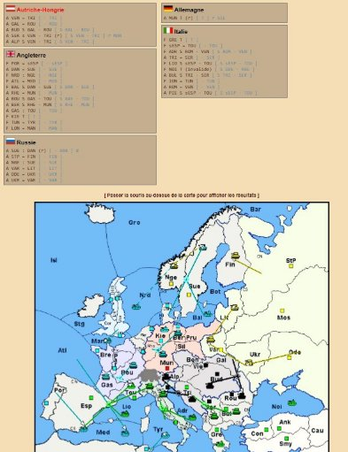

**AFJD Les écrans de jeu**

**Mise à jour 27/10** 

- **Intégration des commentaires de Jérémie**
- **Ajout d’écrans (à partir du chap 1.4)**

Elaborée par : l’équipe projet site AFJD

Synthèse : Olivier Prigent : [o.prigent@e-animedia.com  / 06 ](mailto:o.prigent@e-animedia.com)85 222 81 79

Version du 26/10/2020

Les écrans de jeu V2-version 271020 

**S O M M A I R E**

[***1. Les écrans du site actuel_________________________________________3***](#_page2_x106.30_y89.40)

1. [**Les menus de jeu prévus pour le moment :_______________________________3**](#_page2_x106.30_y121.60)
1. [**Accéder à mes parties en cours / Jouer :_________________________________3**](#_page2_x106.30_y608.00)
1. [**La page de jeu pour un joueur (et non pour le MJ)________________________5**](#_page4_x106.30_y83.40)
   1. [Les informations___________________________________________________5](#_page4_x177.10_y120.00)
   1. [Les actions________________________________________________________6](#_page5_x177.10_y454.20)
   1. [Le passage d’ordre__________________________________________________8](#_page7_x177.10_y497.80)
4. [**La création d’une partie : le cahier des charges initial commenté___________11**](#_page10_x106.30_y77.40)
4. [**Ce que fait le moteur actuellement_____________________________________16**](#_page15_x106.30_y442.10)
4. [**La page de jeu pour le MJ____________________________________________18**](#_page17_x106.30_y444.20)

**1. LES ÉCRANS DU SITE ACTUEL**

1. **Les menus de jeu prévus pour le moment :**

   En rouge, les menus associés au jeu lui-même.

- Jouer
- Parties 
  - Accéder à mes parties en cours
  - S’inscrire sur une partie
  - Créer une partie
  - Remplacer un joueur
  - Consulter mon historique
  - Rechercher une partie
- Des nouvelles du front
  - Parties ouvertes récemment
  - Tournois et championnat
  - Calendrier des lives
  - Faces à face
  - Les classements
- Le jeu
  - Présentation du jeu
  - Les règles
  - Variante
  - Initiation 
- Communauté
  - Actualité
  - Evénement
  - Articles
  - Forum
  - Sondage
- Bibliothèque
  - Archives des parties
  - Archive des sondages
- Qui sommes-nous
2. **Accéder à mes parties en cours / Jouer :**

   C’est le cœur du réacteur, pouvoir accéder à son tableau de bord qui liste les parties en cours. 

   Evidemment, on peut envisager de coupler cet écran avec les écrans d’inscription à une partie comme : s’inscrire à une partie, remplacer un joueur ou créer une partie. 

   En effet, quand je clique sur « **JOUER** », si je n’ai pas de parties en cours, je peux avoir envie de rejoindre une partie ou d’en créer une.

   Si on revient sur « Accéder à mes parties », il va falloir en un seul coup d’œil visualiser un ensemble d’informations :

- La liste de mes parties
- Le type : blitz, négo, autres formats (brouillard –non activé pour le moment etc).
- L’année : en quelle années sommes-nous ?
- La saison : printemps/automne
- La phase d’ordre : ordre à faire, retraite, ajustement
- Le statut : validé, à valider. A voir si on conserve le statut enregistré mais non validé.
- La notification indiquant la présence de messages reçus : privé, publics.
- La date de la DL
- Une information claire sur le risque de retard
- Il doit être possible d’archiver des parties pour ne plus les visualiser dans son tableau
- Il doit être possible de les trier par critère
- D’autres informations sont intéressantes : la catégorie (si la partie fait partie d’un championnat, une ligue, un tournois etc), le nom du MJ

A voir si sur ce même tableau, on fait figurer :

- La nature de la carte (la plupart des parties sont classiques à 7 pays mais il existe des variantes).  Nous n’avons pas développer le module tournois pour le moment.

A titre d’exemple, voici le tableau de bord de DOL : Attention, ce n’est pas une proposition à vocation inspirationnelle

3. **La page de jeu pour un joueur (et non pour le MJ)**
1. ***Les informations***

On entre dans une des parties présentes pour réaliser un tour de jeu.

Plusieurs informations sont nécessaires :

- Qui sont les joueurs de la partie : pays et nom (si non anonyme sinon pas de nom).
- Leur nombre de centres/ d’unités
- Leur  statut :  absent,  disponible (notion de présence à définir :  dernière connexion < xx. Il y a aussi la notion de connecté. Le moteur fournit la dernière identification.
- Quel est leur statut : ordres validés, enregistrés, en attente. Attention, cette option de visualisation pourra être paramétrable au moment de la création. A arbitrer.
- La situation de la partie : année, saison, type d’ordres attendus (retrait, ordre, ajustement, fin de partie)
- Les informations génériques de la partie : conditions de victoires (cela peut être l’année, un nombre de centres atteints). Pas encore géré dans le moteur.
- La prochaine DL (date limite)
- La date du dernier tour joué
- Et évidemment la visualisation de la carte

Quelques captures de DOL :

2. ***Les actions***

A partir de cette situation, je dois pouvoir mener un certain nombre d’actions :

- Consulter les mouvements du coup précédent (A ce jour, le moteur ne le gère que sous forme de texte)
- Passer mes ordres
- Consulter mes messages : les messages généraux (public pour tous), les messages privés, message au MJ, message à l’ équipe (si une notion d’équipe existe sur le tournois).
- Envoyer un message privé à un pays, envoyer un message à plusieurs pays en même temps. A voir : envoyer un message à plusieurs pays avec une notion de copie cachée (Aujourd’hui, le système privilégie un envoi x à y)
- Pouvoir répondre aux messages, consulter l’historique etc.
- Consulter l’historique des mouvements sur cette partie en remontant par saison et par année assez simplement.

On voit ici que je peux consulter l’historique des mouvements du tour en texte et via des flèches sur l’écran.

A voir sur les tournois où des scores sont générés en fonction de règles, cela pourrait être intéressant d’afficher les points associés à la partie par joueur. (A voir dans le module tournois)

3. ***Le passage d’ordre***

**Voici ce qui était indiqué dans le précédent cahier des charges. Les commentaires en rouge ont été ajoutés :**

Sur Diplomacy, chaque année de jeu est divisée en 5 phases

- 2 phases d’ordres (Printemps et Automne) :

Ce sont les phases les plus importantes du jeu, et, en termes de design, certainement la phase la plus critique. Il importe que l’interface soit la plus claire et la plus simple possible pour les joueurs.

Certains joueurs préfèreront saisir leurs ordres sous forme d’un texte standardisé. D’autres par simple click sur la carte interactive. Il importe de laisser aux joueurs le choix entre l’une ou l’autre la possibilité. **ATTENTION : on ne tentera pas l’usage de la souris pour le moment, même si on le garde en tête**.

On voit ici que le passage d’ordre se fait par liste.

Chaque joueur rentre ses ordres en simultané. Il existe six types d’ordres :

- Tenir : A Par T
- Mouvement simple : A Par-Bou
- Convoi : F Man C Lon Bel
- Soutien défensif : A Gas S Par
- Soutien offensif : A Gas S Par-Bou

Les joueurs entreront leurs ordres en utilisant le dictionnaire des abréviations qu’ils auront  défini  dans  leurs  options  personnelles. Dictionnaire  éventuellement paramétrable à la création de partie, à voir. Fichier fourni par le moteur, qui peut être changé.

Lorsque les ordres sont entrés, un premier filtre de contrôles est effectué pour signaler au joueur les éventuels ordres impossibles. En parallèle, l’interface simulera l’effet des ordres possibles.

Important : il faut prévoir un simulateur permettant de visualiser le résultat de ce que l’on prévoit de faire. (On pourra par la suite envisager la possibilité de changer la position de départ à analyser mais à voir ultérieurement)

Le joueur aura alors la possibilité de modifier ses ordres possibles. En ce qui concerne les ordres impossibles, c’est l’option « Communication par ordres » qui détermine si le joueur peut quand même les rentrer dans le moteur ou si la modification est obligatoire pour pouvoir déposer ses ordres.

On peut décider d’autoriser la validation d’un ordre impossible ou de l’interdire (cela se décide lors de la création de la partie). Non développé actuellement. Aujourd’hui : le système détecte les ordres impossibles et refuse la validation, en revanche, il accepte les ordres illogiques (qui peuvent être contradictoire par exemple). Il y a une notion de validation : sans validation, pas d’ordre et pas de validation si ordre impossible. C’est la situation actuelle.

Tout joueur doit pouvoir reprendre ses ordres et les modifier tant que la résolution n’a pas démarré.

La résolution est déclenchée à des intervalles fixés à l’avance.

- Minuit GMT pour les parties lentes
- Toutes les heures pour les parties rapides

A voir : la résolution est soit automatique (10 minutes après que tout le monde ait validé), soit décidée à une heure précise définie par le MJ. Un débat existe sur la question des fuseaux horaires des joueurs à prendre ou à ne pas prendre en compte.

Elle peut aussi être avancée sur intervention de l’arbitre.

Si l’option Live est activée, l’interface montrera qui a déposé ses ordres et qui ne l’a pas encore fait. 

Dans le cas contraire, seul le MJ non joueur aura accès à cette information. Ce point est également un point de débat.

- 2 phases de retraites (Printemps et Automne) :

A l’issue de chaque phase d’ordres, une phase de retraite a lieu si au moins un des joueurs dispose d’au moins une case libre pour sa retraite. Il peut alors choisir de retraiter sur la case libre proposée ou détruire son unité.

Le système doit donc lui proposer les possibilités de retraites avec l’alternative de destruction (toujours proposée).

Le moteur ne le prévoit pas aujourd’hui, à voir si l’IHM pourra le proposer.

Une fois que tous les joueurs ayant un choix à faire l’ont fait, la résolution des retraites passe. Si deux unités demandent à retraiter sur la même case, elles sont détruites 

Si personne n’a de choix de retraite à faire (pas de retraite ou unité obligatoirement détruite en l’absence de case disponible pour la retraite), alors la résolution passe automatiquement au tour suivant : Ordres d’Automne ou Ajustements d’Hiver.

On voit ici les ajustements proposés

- Ajustements d’Hiver :

A l’issue de la phase de retraites d’Automne, les joueurs ajustent leurs unités en fonction du nombre de centres possédés :

Lorsque tous les joueurs ont validé leurs ajustements, et si la condition de victoire n’est pas remplie, la résolution passe au Printemps de l’année suivante. Il en est de même si aucun des joueurs n’a d’ajustement à faire.

4. **La création d’une partie : le cahier des charges initial commenté Ci-dessous, les éléments du cahier des charges initial annotés en rouge.**

   Une partie est définie par son nom et la variante sur laquelle elle se base. Ces deux paramètres, structurants, ne peuvent plus être changés par le MJ après la création de la partie.

   Ensuite, lors du processus de création de la partie, le MJ sélectionnera les différentes options :

- Type de partie (liste déroulante) : Cette option est modifiable après la création

de la partie. Il y a trois possibilités : « Partie standard », « Tournoi Junior », « Tournoi Senior ». L’option par défaut est « Partie standard ». Seules certaines personnes avec des droits étendus (comme les organisateurs de tournoi) pourraient avoir le droit de la changer, la grande majorité des joueurs conservant cette « Partie Standard ». Cette option n’a aucune incidence sur le jeu, elle est purement statistique pour flaguer plus facilement les parties de tournoi et les parties remarquables. La modalité de « Tournoi Junior  »  sera  utilisée  pour  les  parties  de  tournois  avec  une  faible  sélection (typiquement, phase de qualifications ou ligues inférieures de la Diplo-Ligue) et la modalité de « Tournoi Senior » sera utilisée pour les parties dans lesquelles le niveau est plus relevé (typiquement phase finale de tournoi ou ligues supérieures de la Diplo- Ligue). L’intérêt de ce double niveau de flag pour les parties de tournois est de pouvoir produire des statistiques différenciées en fonction du niveau (au moins supposé) des joueurs dans la partie, ce qui pourra être bien utile lors d’analyses statistiques de la base de données.

Commentaire : la liste de type de partie n’est pas arrêtée et devra être modifiable, on peut partir sur cette typologie. 

A ce stade il manque le choix de la carte qui peut être un couple variante/nombre de joueurs.

- Conditions de victoire : Cette option n’est pas modifiable après la création de

la partie. Il y a trois possibilités :

- Victoire par solo (un solo est atteint lorsqu’un joueur sur la carte possède la moitié des centres de la carte + 1). C’est le choix par défaut. Toujours applicable quel que soit la condition de fin.
- Victoire aux points, à l’issue d’un nombre prédéfini d’années de jeu. Le MJ défini alors le nombre de tours de jeu et le système de scoring associé. Le nombre de tours par défaut, la liste des systèmes de scoring possible et le choix par défaut du scoring dépendent de la variante.
- Victoire par arrêt de l’arbitre. Le jeu continue jusqu’à ce que le MJ décide de fermer la partie. (le plus souvent, cette décision est prise en concertation avec les joueurs).Arrêt par stabilité en centres
- Tirage aléatoire des pays : (Option oui/non). Cette option est modifiable après

la création de la partie. Si l’option est activée, alors le pays est attribué au hasard par le site (on veillera à s’assurer que l’algorithme de distribution ne comporte pas de biais et que les probabilités d’attribution des pays restent identiques. Si elle est désactivée, le

joueur (ou le MJ) pourra choisir la répartition.

Lorsque l’option est activée, l’interface ne devra, en aucune manière, montrer avant le début de la partie quels sont les pays déjà choisis par les joueurs qui sont déjà rentrés. Cette information ne sera révélée qu’au début de la partie.

- Sélection des joueurs : l’interface prévoira deux possibilités pour recruter des

joueurs : Soit faire apparaitre la partie dans une liste de parties en attente, ouvertes à tous les joueurs du site qui vérifie les conditions d’entrées fixées par le MJ, soit procéder à l’envoi d’invitations privées aux joueurs présélectionnés par le MJ : Lorsque la partie est ouverte à tous les joueurs du site, le MJ peut cependant définir une ou plusieurs conditions d’entrée (option à choix multiples). Cette option est modifiable en cours de partie. Par défaut, aucune condition n’est sélectionnée, ce qui signifie que la partie est ouverte à tous les joueurs. Au cas où plusieurs conditions sont sélectionnées, ces conditions sont cumulatives. 

Les conditions possibles sont :

- Entrée d’un mot de passe
- Score de performance supérieur à un minimum prédéfini.
- Score de régularité supérieur à un minimum prédéfini.

Remarque : le moteur actuel gère 3 indicateurs (fiabilité, performance et régularité) On pourrait probablement les préciser ainsi :

Fiabilité : je n’abandonne pas une partie en cours

Performance : mes résultats

Régularité : mon niveau de fréquentation, volume de jeux (à vérifier)

Lorsque la partie est limité à des joueurs prédéfinis, le MJ définira la liste des joueurs qu’il souhaite inviter dans la partie, et éventuellement (dans le cas où l’option de tirage au sort des pays est désactivée) le pays que le MJ souhaite voir jouer par chaque joueur. Au cas où le MJ n’attribue pas de pays à un joueur, le joueur pourra choisir parmi les pays disponibles.

Lorsque le MJ a renseigné les joueurs invités et éventuellement la répartition souhaitée, l’interface envoie à chaque joueur invité un message du type « le MJ Tartempion vous invite à jouer la France dans la partie Bidule, voulez-vous rejoindre oui / non ».

Au cas où le joueur invité rejette l’invitation, la main revient au MJ qui décide soit d’inviter un autre joueur, de mettre la partie en recherche de remplaçant, soit de mettre le joueur en désordre civil.

- Type de partie : Nego / Blitz. Le choix par défaut est « Négo ». Dans une

partie négo, l’interface permet aux joueurs de communiquer de manière privée entre eux, en plus du fil de discussion général. Dans une partie blitz,  aucune comunication possible

Le MJ, même non joueur, n’a pas accès aux fils de négociation privée. Droits du MJ sur les messages à préciser.

En revanche les administrateurs, ont accès aux discussions privées.

Tout message supprimé devra être reporté dans le log des parties, accessible uniquement par les administrateurs non joueurs, pour des fins de contrôle (non-respect de la charte de savoir vivre, ou investigation de tricherie).

Dans les deux cas (blitz, nego), un fil spécial permettant de communiquer de manière privée avec le MJ est disponible. 

Il devrait également y avoir un fil général pour communiquer avec l’ensemble des joueurs.

Il devra être suffisamment séparé des canaux de discussion des joueurs, pour que dans le cas d’un MJ joueur, il n’y ait pas de confusion entre la communication joueur et la communication MJ, et pour que le pays joué par le MJ ne soit pas révélé si la partie est anonyme.

- Communication par ordres : Cette option, modifiable en cours de partie par le

MJ, permet de définir le niveau de communication autorisé dans la feuille d’ordre. Si elle s’applique en théorie aux parties Nego et Blitz, c’est bien entendu en Blitz qu’elle présente tout son intérêt. Ce point a déjà été évoqué plus haut : aujourd’hui il n’est pas géré puisque les ordres impossibles ne sont pas validés.

Trois options sont possibles : (Le brouillard n’est pas géré actuellement)

- Brouillard : Cette option, modifiable en cours de partie par le MJ, permet de

poser un brouillard de guerre. Trois options sont possibles :

1) Pas de brouillard : (choix par défaut). Toutes les unités sont visibles. Tous les centres sont visibles.
1) Brouillard léger : Un joueur ne verra que les cases adjacentes aux cases où ses propres unités sont positionnées. La feuille d’ordre et la carte donneront cependant des indications sur les centres possédés par les adversaires, le nombre d’unité des adversaires, les type d’ordres passés et leur résultat (en occultant l’origine et la destination). Par ailleurs, lorsqu’une unité d’un joueur effectue un mouvement, le compte-rendu indiquera aussi si une autre unité se rend dans une case adjacente à la case de départ de son unité. Ex : Si A Mun-Bou et A Ven-Alp, le joueur en Mun pourra voir dans le compte-rendu qu’une armée est arrivée en Alp (sans savoir d’où elle vient).

   Quelle que soit l’option choisie, elle ne s’appliquera pas au MJ (ou à un admin) non- joueur, qui pourra continuer à voir la carte en toute circonstances. En revanche, le MJ joueur aura bien entendu ces restrictions.

- Anonymat : Cette option oui (par défaut) / non, , permet de ne pas afficher

l’identité des joueurs dans la partie. Le MJ (ou un admin), uniquement s’ils sont non joueurs, peut voir qui joue sur la table même si l’anonymat est activé.

- Live : Oui / Non (par défaut), modifiable en cours de partie par le MJ. Cette

option permet de visualiser qui a passé ses ordres et qui ne les a pas encore passé. Le MJ (ou un admin), uniquement s’ils sont non joueurs, peut accéder à cette information même si l’option choisie est « non ».

- Nombre de jours pour les phases d’ordres (par défaut 2) : Indique l’intervalle

entre la résolution et la prochaine DL pour les phases de printemps et d’automne. Elle est modifiable en cours de partie par le MJ.

- Nombre de jours pour les phases de retraites et d’ajustements (par défaut 1) :

Indique l’intervalle entre la résolution et la prochaine DL pour les phases de retraites et d’ajustements. Elle est modifiable en cours de partie par le MJ.

- Anti week-end : Oui (par défaut) / Non : Cette option permet de repousser au

Lundi suivant toute DL tombant un Samedi ou un Dimanche.

- Retraites et ajustements par défaut en cas de retard (par défaut non)

b. Le démarrage d’une partie.

Une fois que toutes les options ont été choisies par le MJ créateur de la partie, celle-ci passe en attente des joueurs qui peuvent soit s’y présenter spontanément s’ils remplissent les conditions d’entrées, soit rejoindre la partie via l’invitation qu’ils ont reçue.

Lorsque tous les joueurs sont présents, le MJ démarre formellement la partie.

Une partie peut être supprimée par le MJ tant qu’elle n’a pas démarré. Dans ce cas, elle est purement et simplement supprimée de la base de données. En revanche, une partie démarrée ne pourra pas être supprimée. Elle devra être terminée suivant la procédure normale.

Exemples des écrans DOL pour aider mais ils ne sont pas à vocation inspirationnelle.

5. **Ce que fait le moteur actuellement**

   On voit ci-dessous les paramétrages actifs

   

   Ci-dessous la feuille de route pour la création de partie notamment Voir document de Jérémie : apis\_rest

   

   

   

6. **La page de jeu pour le MJ**

   Le MJ va pouvoir gérer des actions complémentaires :

- Paramétrer la partie : voir à la création.
- Démarrer une partie lorsqu’elle est complète.
- Proposer une DL
- Forcer une résolution avant la Date limite (DL)
- Donner un délai supplémentaire
- Exclure un joueur avec ou sans sanction par rapport à la fiabilité
- Demander un remplacement
- Mettre en désordre civil les unités d’un joueur
- Effectuer une modification sur la carte pour corriger une erreur de traitement
Page 18
